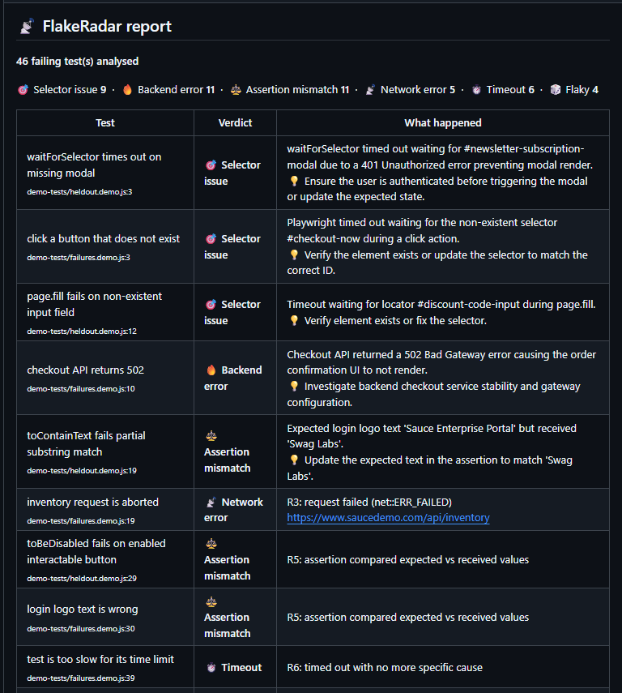

# 📡 FlakeRadar

**A Playwright reporter that explains why your CI tests failed, and comments on the Pull Request.**

<!-- Replace with your real screenshot: save it as docs/pr-comment.png and commit it -->


> Live example: [see the demo Pull Request](https://github.com/Prakhar10101/flake--radar/pull/2)

---

## The problem

When a Playwright suite fails in CI, you get a wall of red text and maybe a large trace file. Someone has to work out whether the failure was a broken backend, a changed selector, a network blip, a flaky test, or a real bug.

FlakeRadar does that first triage automatically and posts a short table on the Pull Request.

## How it works

```
test fails
   │
   ▼
fixture records failed requests + last console lines
   │
   ▼
reporter collects error + evidence (and notes retries)
   │
   ▼
redaction removes emails, tokens, passwords
   │
   ▼
rules classify the failure  ──── matched ───▶  verdict (no LLM call)
   │ no rule matched
   ▼
LLM classifies it (fallback) + writes a short summary
   │
   ▼
Markdown report → PR comment, Actions job summary, local file
```

**Design in one line:** deterministic rules first, an LLM only for what the rules can't decide, and the report always shows which rule fired.

## Categories and rules

Rules run in this order. The first match wins, because specific causes come before symptoms (a 500 response explains a missing button, not the other way around).

| # | Rule | Category |
|---|---|---|
| R1 | Failed, then passed on retry | `FLAKY` |
| R2 | A same-site response had status 5xx | `BACKEND_ERROR` |
| R3 | A same-site request failed (aborted, reset, blocked) | `NETWORK_ERROR` |
| R4 | Locator found no element, or matched several (strict mode) | `SELECTOR_ISSUE` |
| R5 | `expect(...)` compared values on an element that was found | `ASSERTION_MISMATCH` |
| R5b | An action timed out waiting for its element | `SELECTOR_ISSUE` |
| R6 | Playwright timeout with nothing more specific | `TIMEOUT` |
| none | No rule matched | `UNKNOWN` → LLM fallback |

## Quick start

> FlakeRadar is not published to npm yet. Copy the `src/` folder into your project.

1. Add the reporter in `playwright.config.js`:

   ```js
   reporter: [['list'], ['./src/reporter.js']],
   ```

2. Import `test` from the fixture instead of `@playwright/test` (this is what records network and console data):

   ```js
   const { test, expect } = require('./src/fixture');
   ```

3. Optional, for LLM classification and summaries, set these (locally in `.env`, in CI as repository secrets):

   | Variable | Purpose |
   |---|---|
   | `LLM_BASE_URL` | Base URL of an OpenAI-compatible API |
   | `LLM_API_KEY` | API key |
   | `LLM_MODEL` | Model name |
   | `LLM_MAX_CALLS` | Cap on LLM calls per run (default 20) |
   | `LLM_MIN_GAP_MS` | Minimum gap between LLM calls (default 4500) |
   | `FLAKE_RADAR_NO_LLM=1` | Turn the LLM off and use rules only |

4. In GitHub Actions, give the job `pull-requests: write` permission and pass `GITHUB_TOKEN`. See [`.github/workflows/ci.yml`](.github/workflows/ci.yml).

Without any LLM settings, FlakeRadar still works using rules only.

## Evaluation

I built a labeled set of intentionally broken tests. Each test name carries the correct answer, for example `[expect:BACKEND_ERROR]`, and an eval script compares FlakeRadar's verdict against it.

Tests fall into three groups, scored separately:

- **Rule-decided:** a rule made the call.
- **Trap tests:** the rules should *not* claim these (for example a 404 or 422 is not a backend error).
- **Hard cases:** no rule matched, so the LLM fallback decided.

**Results: 46 labeled tests, model: `gemini-3.5-flash-lite`**

| | Rules only | Hybrid (rules + LLM) |
|---|---|---|
| Rule-decided cases correct | 34 / 35 | 34 / 35 |
| Trap tests handled correctly | 5 / 5 | 5 / 5 |
| Hard cases correct | 0 / 6 | 4 / 6 |
| **Overall, excluding trap tests** | **34 / 41 (83%)** | **38 / 41 (93%)** |

- Rules resolved 35 of 46 tests with no LLM call.
- On the 6 failures no rule matched, the LLM fallback got 4 right. Rules alone have no answer for those.

Run it yourself:

```
npm run eval:rules   # rules only
npm run eval         # rules + LLM
```

### Known misses

| Test | Expected | Got | Why |
|---|---|---|---|
| business timeout syntax thrown as validation mismatch | `ASSERTION_MISMATCH` | `TIMEOUT` (rule) | **Rule bug:** R6 matches any message containing "timeout" and "exceeded", so a custom business error is mislabeled. Not fixed yet. Matching only Playwright's own timeout message formats would fix it. |
| server crash masked by frontend console spam | `BACKEND_ERROR` | `ASSERTION_MISMATCH` (LLM) | No failed request was recorded for this test, so no rule fired, and the model had only the error message and console text to go on. The test simulates a backend crash, but its evidence is only frontend text, so the label asks for knowledge the system was never shown. This is a weak test rather than a clear system failure. |
| assertion message discussing network protocol strings | `ASSERTION_MISMATCH` | `NETWORK_ERROR` (LLM) | A deliberate keyword trap. The model was misled by network wording in a plain assertion error. |

### What the evaluation caught

- **A label leak.** My first hybrid score was 100%, which looked too good. I found that the LLM prompt included the test title, and the demo titles contain the expected category. After removing the title from the eval prompt, the hard-case score dropped to 4 of 6. The first score was not a real measurement.
- **A rule bug.** The eval exposed the over-broad timeout rule above.
- **A mislabeled rule.** An early version of the selector rule called a failed text assertion a "selector issue", because Playwright's error output for a found element still contains a "waiting for locator" line. Caught by a labeled demo test, fixed by reordering the rules.

## Design decisions

- **Rules before the LLM.** Most failures can be classified deterministically. That is cheaper, faster, reproducible, and explainable, because the report shows which rule fired.
- **The LLM never breaks a run.** If the LLM is unconfigured, slow, or rate-limited, FlakeRadar falls back to rules only.
- **Redaction before anything leaves CI.** Emails, bearer tokens, JWTs, password and API-key values, and long hex strings are removed before classification, saving, or any LLM call.
- **Rate-limit handling.** LLM calls are spaced out, retried on HTTP 429 or 503, and capped per run. Failures no rule matched get LLM calls first.
- **Same-site network filtering.** Only requests to the site under test are recorded, so third-party analytics noise doesn't cause false verdicts.
- **Report size guard.** GitHub rejects very long comments, so only the first 10 failures get expandable detail sections.
- **Updates, not spam.** The PR comment is edited in place on each push, found through a hidden marker.

## Limitations

- **The test set is synthetic.** I wrote the failures and the labels, using mocked errors on a demo site. The numbers show how consistently the system behaves on known failure types, not how it would perform on a real production suite.
- **The set is small, and some tests were revised after the first run.** The hard-case sample is only 6, so treat that percentage as indicative. Some tests were revised after the first run, and the rules were tuned using this set, so results are development-set results, not a clean held-out evaluation.
- **Network data needs the fixture.** Tests must import `test` from the FlakeRadar fixture. Without it the reporter sees only the error message.
- **Chromium only.** Not tested on other browsers.
- **LLM suggestions can be too literal.** For a failed text assertion, the model may suggest updating the expected value, when the app might be the thing that is wrong.
- **Free-tier limits** shaped the LLM throttling design.

## Project structure

```
src/
  reporter.js    collects failures, runs rules, calls the LLM, writes reports
  fixture.js     records failed requests and console output per test
  rules.js       deterministic classification
  redact.js      removes secrets
  llm.js         OpenAI-compatible client with throttling and retry
  markdown.js    report layout
  github.js      PR comment and job summary
demo-tests/      labeled, intentionally broken tests
test/            unit tests for the reporter itself
eval/            accuracy measurement script
```

## Tests

```
npm test
```

Unit tests cover the rules and redaction, and run in CI on every pull request.

## Built with

Node.js, Playwright, GitHub Actions, and an OpenAI-compatible LLM API.
